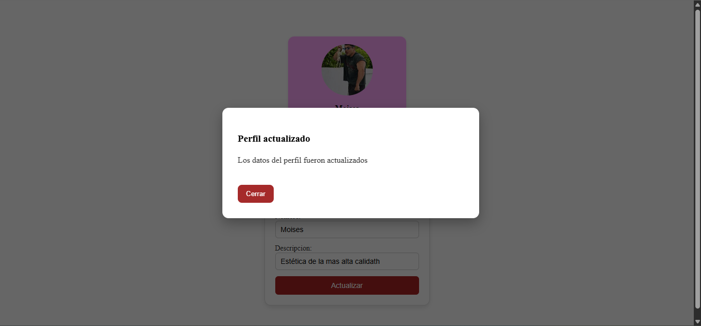
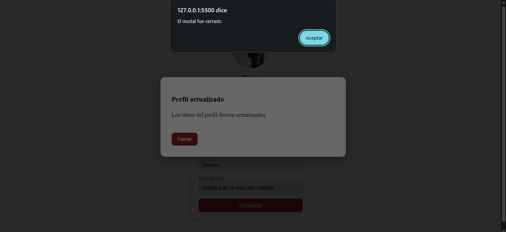
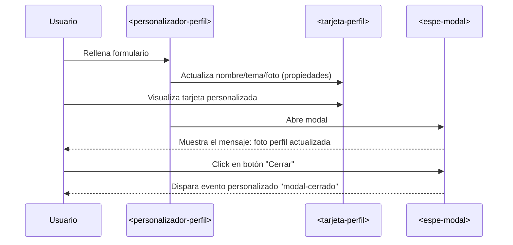

# Nueva Rama: tarea3-especificaciones-avanzadas

En esta rama se añadió un tercer Web Component llamado `<espe-modal>`, el cual muestra un modal que es usado en este ejemplo para mostrar el mensaje de que el perfil fue actualizado exitosamente.


## Objetivo
Desarrollar un componente web avanzado `<espe-modal>` aplicando tecnicas modernas de Web Components, tales como modularizacion con ES Modules, uso de `<template>`, Shadow DOM con slots, y comunicacion mediante eventos personalizados.

## Caracteristicas
* Muestra un cuadro modal centrado con fondo semitransparente.
* Permite personalizar el título y contenido del modal mediante slots con nombre (`<slot name="title">`, `<slot name="content">`).
* Contenido por defecto definido mediante <slot> cuando no se proporciona contenido externo.
* Incluye un boton interno para cerrar el modal.
* Fácil integración en cualquier proyecto HTML a través de una etiqueta personalizada `<espe-modal>`.

## Uso

Clona este repositorio o cambia a la rama `tarea3-especificaciones-avanzadas` y descarga el archivo [espeModal.js](components/espeModal.js). Incluyelo a tu proyecto. Luego llama a los módulos al final de tu `<body>` así:

```html
<script src="espeModal.js" type="module"></script>
```

Después, puedes utilizar el componente `<espe-modal>` directamente en tu HTML con contenido personalizado mediante slots:

```html
<espe-modal id="modal">
    <span slot="titulo">Perfil actualizado</span>
    <p slot="contenido">Los datos del perfil fueron actualizados</p>
</espe-modal>
```

Para cerrar el modal desde el botón interno, simplemente haz clic en el botón "Cerrar" que aparece dentro del componente. Tambien puedes escuchar el evento modal-cerrado para ejecutar acciones personalizadas cuando se cierre el modal:

```js
document.getElementById('modal').addEventListener('modal-cerrado', () => {
    alert("El modal fue cerrado");
});
```

## Slots
| Nombre         | Descripción                                                              | Tipo           |
|:--------------:|:------------------------------------------------------------------------:|:--------------:|
| `titulo`       | Titulo personalizado que se mostrara en la parte superior del modal      | Etiqueta HTML  |
| `contenido`    | Contenido principal del cuerpo del modal                                 | Etiqueta HTML  |


# Reporte Tecnico
## Cómo se logra la modularización con ES Modules.
La modularización con ES Modules consiste en dividir el código en varios archivos más pequeños y específicos, usando las palabras export e import. Esto permite que cada parte del código esté organizada y sea más fácil de entender. Como al crear el componente `<espe-modal>`, lo puedes guardar en un archivo aparte (como espeModal.js) y desde tu archivo HTML lo llamas con `<script type="module" src="espeModal.js"></script>`. Gracias a esto, el código no se mezcla con otras partes del proyecto, es más sencillo de mantener y se puede reutilizarse en otros lugares sin complicaciones.

## Diferencias entre `<template>` y Shadow DOM..
El elemento `<template>` sirve para definir una estructura HTML que no se muestra en pantalla hasta que se usa con JavaScript. Es como un molde: puedes tener allí contenido que luego se copia y se inserta en el componente cuando lo necesites. Por sí solo, no tiene efecto visual ni se renderiza en el DOM principal.

En cambio, el Shadow DOM es una forma de encapsular el contenido y los estilos de un componente para que no interfieran con el resto de la página, ni que el estilo externo lo afecte. Todo lo que está dentro del Shadow DOM vive en una burbuja aislada.

## Casos de uso de eventos personalizados en aplicaciones reales.
Los eventos personalizados son muy utiles en aplicaciones reales cuando diferentes partes de una interfaz necesitan comunicarse entre sí sin estar directamente conectadas. Por ejemplo, en un sistema con varios componentes web, un botón dentro de un modal puede emitir un evento personalizado al cerrarse, y otros componentes o la aplicación principal pueden escuchar ese evento para actualizar datos, mostrar mensajes o activar otras acciones.

# Capturas
Al dar click en el boton Actualizar se muestra automaticamente el modal espe-modal:



Al dar click en Cerrar el modal se ejecuta el evento personalizado cerrar-modal:



Diagrama de comunicación entre componentes.:

