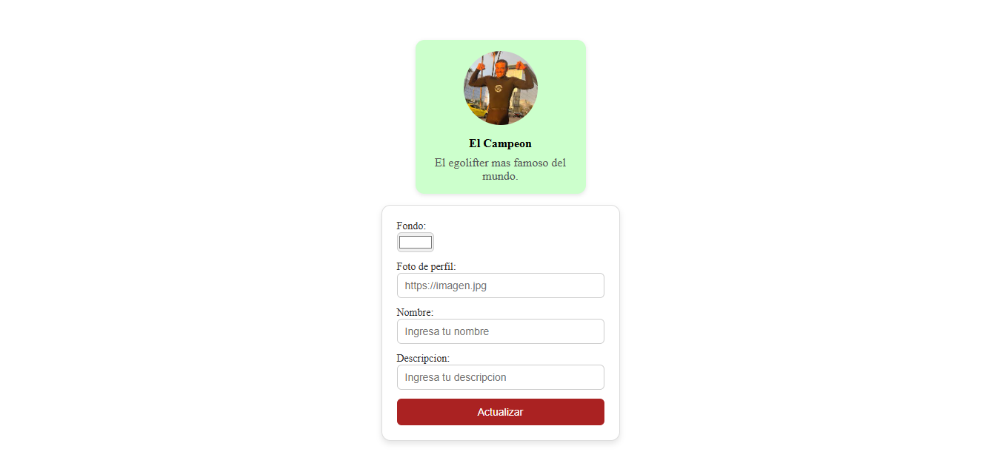
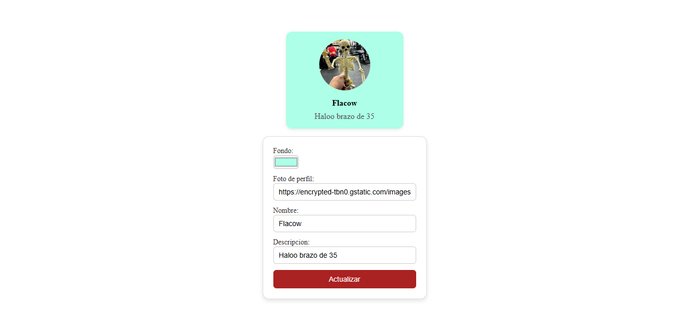
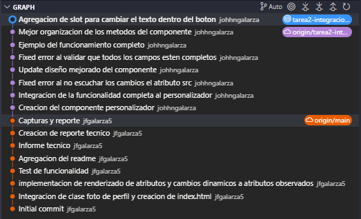

# Nueva Rama: tarea2-integracion-html

En esta rama se añadió un segundo Web Component llamado `<personalizador-perfil>`, el cual permite modificar dinámicamente el contenido y estilo de una tarjeta de perfil `<tarjeta-perfil>` ya existente.


## Objetivo
Permitir la modificacion en ejecucion del componente `<tarjeta-perfil>` mediante un nuevo componente en formato formulario, para mejorar la interaccion del usuario con el componente original.

## Caracteristicas
* Modifica dinámicamente una tarjeta de perfil existente.
* Permite modificar el tema, nombre, descripcion y foto de perfil de la tarjeta.
* Texto del botón personalizable con un `<slot name="boton-text">`.
* Implementa encapsulamiento con Shadow DOM.
* No se aplica cambios si los campos están vacíos.

## Uso

Clona este repositorio o cambia a la rama `tarea2-integracion-html` y descarga el archivo [personalizadorPerfil.js](personalizadorPerfil.js), además del archivo [tarjetaPerfil.js](tarjetaPerfil.js). Incluyelos en tu proyecto. Despues llama a los módulos al final de tu `<body>` así:

```html
<script src="tarjetaPerfil.js" type="module"></script>
<script src="personalizadorPerfil.js" type="module"></script>
```

## Atributos Soportados

| Atributo        | Descripción                                                    | Tipo    |
|:---------------:|:--------------------------------------------------------------:|:-------:|
| `id_tarjeta`    | ID del `<tarjeta-perfil>` que se va a personalizar | String  |

## Slots
| Nombre         | Descripción                                | Tipo           |
|:--------------:|:-------------------------------------------:|:--------------:|
| `boton-text`   | Texto que se mostrara dentro del boton      | Etiqueta HTML  |


# Reporte Tecnico
## Cómo se integran elementos HTML estándar en un Web Component.
En un Web Component se pueden usar elementos HTML normales como formularios, botones o inputs dentro del componente, y todo funciona como en una página común. La diferencia es que esos elementos quedan encerrados dentro del componente gracias al Shadow DOM, así no afectan ni se mezclan con el resto de la página.

## Mecanismos de comunicación entre componentes (ej: eventos personalizados).
Cuando varios componentes web se necesitan comunicar entre sí, lo mas comun es usar eventos personalizados. Usando un componente puede disparar un evento como un click y el otro componente puede escuchar ese evento y reaccionar cuando ocurra.

## Ventajas de encapsular HTML complejo dentro de un componente.

Encapsular HTML complejo dentro de un componente ventajas como mantener el codigo de este componente aislado lo que significa que los estilos o scripts externos no dañan el componente, ni que el componente afecte otras partes de la página. Ademas facilita la reutilización, ya que el mismo componente puede usarse en diferentes partes del proyecto simplemente importandolo.

# Capturas
Al momento de realizar la primera carga del index se muestra los valores por defecto que tiene el componente tarjeta de perfil:



Una vez que se rellena el formulario del nuevo componente y se actualiza, automaticamente cambia el componente tarjeta con los nuevos valores:



Codigo con mi usuario de git:


Los commits recientes de este repositorio:

