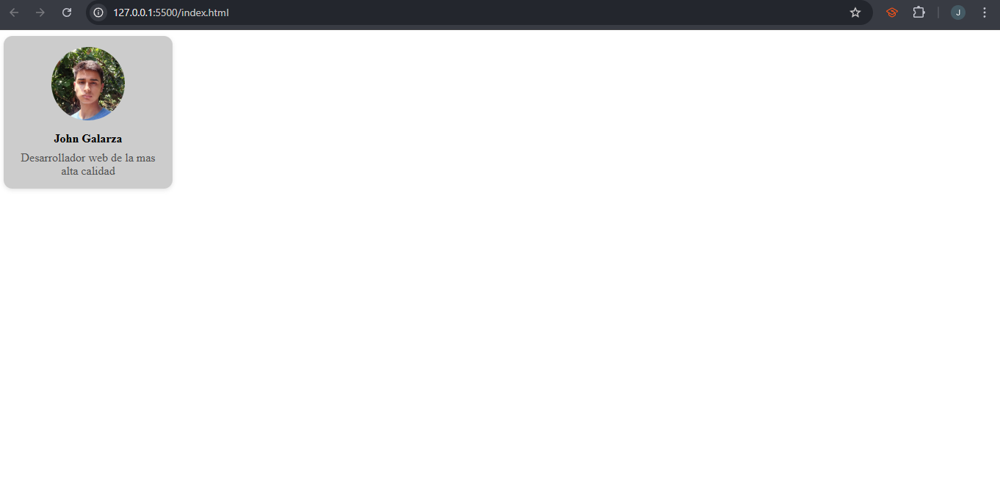
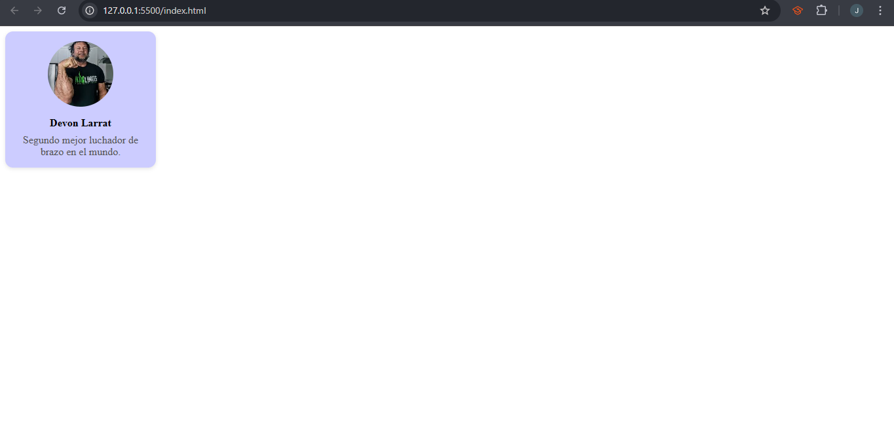
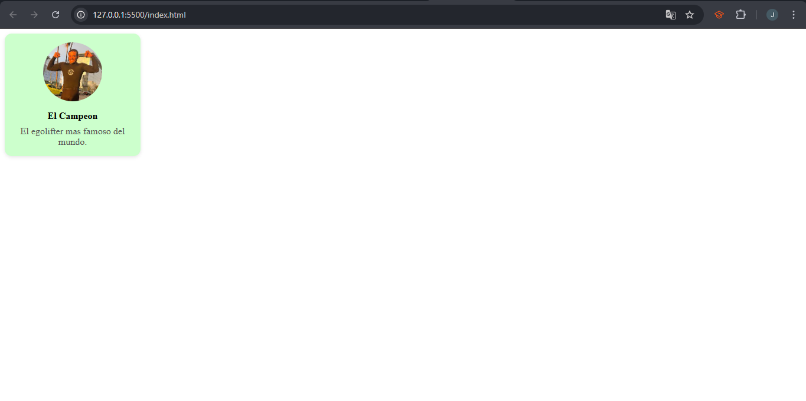

# Web Component: Tarjeta de Perfil

Se creo un componente sencillo que permite agregar una tarjeta de perfil a tu html que incluye una foto, nombre y descripcion de la persona, ademas de el color de fondo de la tarjeta.

## Objetivo
Facilitar el uso de tarjetas de perfil reutilizables y personalizables en html, utilizando las tecnologias Web Components como Custom Elements y Shadow DOM.

## Caracteristicas
- Tarjeta contenedora de 200px.
- Color de fondo personalizable en hex.
- Imagen de perfil circular de 100px.
- Nombre en negrita.
- Descripcion en gris #555 y 10px de fontsize.

## Uso
Clona este repositorio o simplemente descarga el [tarjetaPerfil.js](tarjetaPerfil.js) y ponlo en tu proyecto, luego solo tienes que llamar al modulo mediante: `<>` al final de tu body, luego donde quieras poner la tarjeta usas la etiqueta `<tarjeta-perfil>`.
- Si quieres ver el ejemplo completo en html te dejo el [index.html](index.html)

## Atributos Soportados
|Atributo   |Descripcion                    |Tipo    |
|:---------:|:-----------------------------:|:------:|
|`src`      | Url de la imagen de perfil.   |String  |
|`tema`     | Hex del color de fondo.       |String  |

## Slots
|Nombre       |Descripcion                           |Tipo           |
|:-----------:|:------------------------------------:|:-------------:|
|`nombre`     | Nombre de la persona en el perfil.   |Etiqueta html  |
|`descripcion`| Descripcion de la persona            |Etiqueta html  |

# Reporte Tecnico
## Cómo se logra la encapsulación con Shadow DOM.
La encapsulación con Shadow DOM nos deja aislar la estructura, estilos y comportamiento de un componente web del resto de la página, evitando errore y manteniendo la modularidad del codigo. Shadow DOM crea un DOM independiente dentro del elemento, evitando que los estilos y scripts externos afecten al componente y viceversa, lo que permite que se pueda poner estilos propios a `<tarjeta-perfil>` que no son afectados por estilos externos.
## Diferencias entre slots con nombre y slots por defecto .
| Característica               | Slot por Defecto                    | Slot con Nombre                         |
|-----------------------------|-------------------------------------|------------------------------------------|
| Declaración                 | `<slot></slot>`                     | `<slot name="nombre"></slot>`            |
| Uso                         | Para insertar contenido general     | Para insertar contenido específico       |
| Uso en el componente  | Se usa cuando se necesita solo una ranura de contenido | Se usa cuando se requieren múltiples ranuras con propósitos diferentes |
| Ejemplo de uso en HTML      | `
Lorem ipsun
`             | `El Campeon`|

## Limitaciones de los Web Components en aplicaciones reales.
El uso de web components puede ayudarnos cuando se requieren objetos puntuales, como una tarjeta de perfil sencilla o widgets reutilizables, pero si necesitamos una aplicacion compleja con velocidad de desarrollo talvez usar web components hechos desde cero no sea la mejor opcion, se puede optar por el uso de frameworks modernos que nos facilitan el uso de componentes y nos podemos enfocar en la funcionalidad de nuestra aplicacion real.

# Capturas
Ejemplo de uso Tarjeta de perfil 1

Ejemplo de uso Tarjeta de perfil 2

Ejemplo de uso Tarjeta de perfil 3

Codigo con captura de mi User

